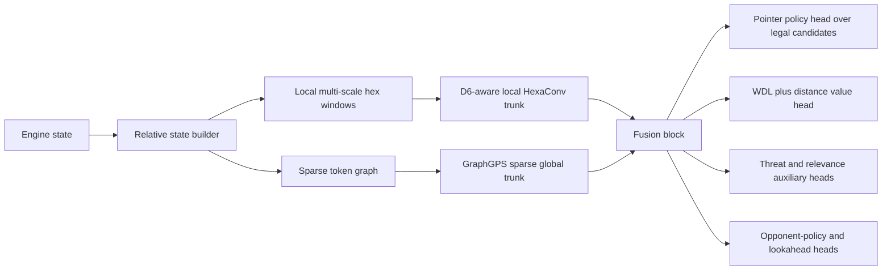
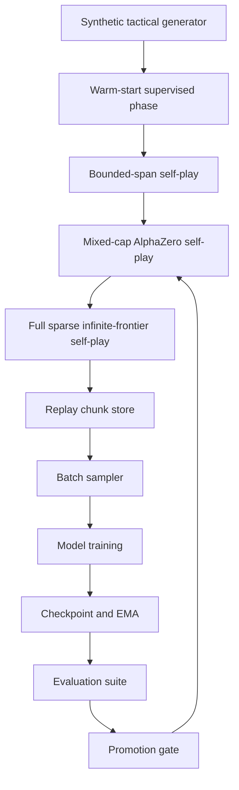

# Theoretical Best Architecture for Infinite Hex Connect-6 in Hexo-BotTrainer

## Executive summary

The strongest design for an **infinite-board, hexagonal-tile, connect-6-style** game is not a pure CNN, a pure GNN, or a pure Transformer. The best architecture is a **hybrid, AlphaZero-style policy-value model** that combines a **local D6-aware hex-convolutional encoder** for short-range threat motifs with a **sparse graph/Transformer module** for long-range dependency tracking, and then predicts **one placement at a time** with a legality-masked pointer head. That recommendation follows from three facts in the literature and in your codebase: hex lattices have exploitable 6-fold symmetry and benefit from hex-native convolutions, GNN-style relational models help with long-range dependencies in Hex-like games, and hybrid local+global backbones have recently beaten pure residual stacks on board-game pattern recognition and playing strength. citeturn46view2turn47view1turn48view1

For **Hexo-BotTrainer**, the architecture should be built around the repository’s existing single-placement engine contract rather than pair-action policies. Your engine already exposes deterministic **single-placement legal action IDs**, explicit **Opening / FirstStone / SecondStone** phases, and stable action-ID handling at the Python boundary, which makes autoregressive single-placement play the natural fit. However, the repository also contains the single biggest blocker to a literal infinite board: the current Python action-ID packing uses **16-bit coordinate components**, capping \(q,r\) to the i16 range. That needs to be fixed before any “infinite board” claim is true in implementation. citeturn13view0turn13view1

The current dense CNN package is a useful baseline but not a final answer. Today it uses a **fixed 41×41 crop**, **13 input channels**, **96 channels**, and **6 residual blocks**, with policy, value, opponent-policy, and lookahead heads; its input encoding is center-relative and already tracks legal moves, phase, first-stone state, recency, hot cells, and D6 symmetry. Those are good ideas to preserve, but a fixed crop and flattened dense heads are not theoretically ideal for an unbounded board. citeturn9view0turn22view1turn34view1turn36view3

The best overall plan is therefore:

- **Recommended final model:** a **HexaConv + GraphGPS/relative-attention hybrid** with candidate tokens, window tokens, and legal-masked autoregressive pointer outputs. citeturn46view2turn48view0turn43search0turn43search1
- **Recommended training regime:** **AlphaZero/KataGo-style self-play** with PUCT, playout-cap randomization, D6 augmentation, opponent-policy and tactical auxiliary heads, and a file-backed replay system rather than the current in-RAM compressed replay. citeturn42search0turn46view1turn40view0turn20view2
- **Recommended integration sequence:** first fix coordinate IDs and sample storage, then expose engine window/threat metadata and delta-based search, then land the hybrid model package. The repo’s own review plan is already pushing toward undo-capable deltas for MCTS because repeated full-state cloning is expensive. citeturn7view1turn24view0

## Design objectives and repository baseline

Classical Connect6 alternates **two placements per turn**, except that the first player makes only one opening placement; that structure is exactly why an autoregressive single-placement formulation is attractive here, because it turns “choose a pair” into “choose the first placement, then choose the second placement conditioned on the updated phase and first stone.” The game you want differs from classical Connect6 because your arena is an **infinite hex grid** rather than a finite square-grid intersection board, but the turn-structure argument still transfers cleanly. citeturn45search0turn13view1

Your repository is already closer to that formulation than a typical game engine. The Python API exposes an exact Rust-backed state object, deterministic legal single-placement action IDs, a current-player query, game-terminal queries, and `TurnPhase` values `OPENING`, `FIRST_STONE`, and `SECOND_STONE`. The Python mirror of engine state also includes a **window store**, legal-move store, placement history, and first-stone bookkeeping. That is exactly the information a strong autoregressive model wants. citeturn13view0turn13view1

There are also repository facts that strongly constrain the design. First, `AxialCoord` is already the public coordinate type, which is good for a hex game. Second, the current packing of action IDs into an integer uses a fixed offset and 16-bit coordinate components, which restricts each component to the i16 range. Third, the dense model’s current config hard-codes a dense crop size and fixed channel count. Taken together, this means the codebase already thinks in axial hex coordinates and phase-conditioned single moves, but it still assumes a bounded local tensor view and bounded coordinate encoding. citeturn13view1turn9view0

The current `dense_cnn` package is informative because it reveals what the repo values. Its architecture uses masked 3×3 “hex” convolutions, gated residual blocks, a dense crop policy head, a **65-bin value head described as KataGo-style**, an opponent-policy head, and optional lookahead heads. Its input encoder builds center-relative planes for empty cells, own/opponent stones, legal cells, phase, first-stone, player color, recency, and tactical “hot” sets, with D6 transforms available at training time. The trainer samples from a **capacity-bounded, compressed in-RAM replay buffer** and applies a fresh random D6 symmetry when expanding each compact sample. citeturn22view1turn34view1turn36view1turn40view1turn40view0turn37view0

There is also a clear performance trajectory already visible in the repo. `dense_cnn` self-play uses batched neural inference and can call a Rust batched-MCTS bridge when available, but the Python fallback still clones state along simulations. Separately, the repository’s review plan explicitly recommends moving Rust search to an **apply/undo delta** model because cloning `HexoState`—including stones, legal store, windows, placement history, and terminal metadata—becomes expensive as search and concurrency scale. That means the best model architecture should be paired with an engine-side search rewrite; otherwise the network will not be the true bottleneck. citeturn24view0turn7view1

The current training pipeline is also only half-finished at the shared layer. `hexo_train` intentionally centralizes orchestration, but its shared sample-store/index/window utilities are still placeholders, while `dense_cnn` circumvents that by owning its own replay buffer. For a research-grade infinite-board model, that is not good enough: sparse graph states, threat labels, and candidate sets need a proper chunked, versioned storage format. citeturn12view3turn20view2turn36view0

A concise way to read the repository, then, is this: **the engine and turn model already favor your preferred autoregressive single-placement policy, but the model/input/storage layers are still fundamentally dense-crop prototypes, and the coordinate packing is not yet infinite-board safe.** citeturn13view0turn13view1turn22view1turn40view0

## Recommended architecture

The recommended final architecture is a **translation-relative, D6-aware, hybrid local-global model**:

1. a **local hex-native encoder** that is equivariant or approximately equivariant to D6 board symmetries;
2. a **sparse graph/Transformer stage** over active stones, frontier candidates, and tactical window tokens;
3. a **single-placement pointer head** over a finite candidate set supplied by the engine/frontier generator;
4. a **WDL-plus-distance value head**; and
5. **auxiliary tactical heads** for threat depth, relevance zones, opponent priors, and symmetry consistency.

This recommendation is grounded in four strands of evidence. HexaConv shows that native hex convolutions exploit the 6-fold symmetry of a hex lattice and reduce anisotropy relative to ordinary square convolutions. GraphGPS shows that combining local message passing with global attention can retain expressivity while scaling linearly in nodes and edges. A Hex-specific GNN study found that GNNs help with long-range dependencies and overfit less, though they are weaker on local pattern extraction. And ResTNet shows that explicitly interleaving residual local blocks with Transformer-style global blocks improves strength and long-pattern recognition in board games, including Hex. citeturn46view2turn48view0turn47view1turn48view1



The most important architectural decision is to **abandon fixed dense policy outputs over crop cells as the primary action interface**. On an infinite board, the network should not emit a logit for every cell in an arbitrarily chosen square crop and hope the right move is visible. Instead, it should score a **candidate set**. That candidate set is finite even on an unbounded board if it is built from engine legal moves, tactical windows, and frontier expansion rules. The policy head therefore becomes a **pointer / maskable ranking head** over candidate tokens rather than a flattened `BOARD_AREA` classifier. This preserves your single-placement preference and aligns exactly with the repository’s legal-action API. citeturn13view0turn22view1

The best **local backbone** is a **D6-aware HexaConv residual tower**. Early layers in connection games mostly learn short-range geometric motifs: five-in-a-row threats, blocked segments, double threats, extensions, forks, and one-move defenses. Those are local, translation-tied, and symmetry-rich. HexaConv’s main appeal here is not image-classification performance per se, but the architectural fact that a hexagonal lattice admits **6-fold rotations** natively, making orientation-sharing more natural than with square kernels. In code, the fastest migration path is to start from your existing masked 3×3 `HexConv2d` but replace or augment it with a proper p6/p6m-style equivariant block family later. citeturn46view2turn33view0

The best **global backbone** is a **GraphGPS-like sparse graph Transformer** rather than full dense attention. The graph should include at least four token classes: occupied-stone tokens, legal-candidate tokens, tactical-window tokens, and a small set of global tokens such as `state`, `phase`, and `first_stone`. GraphGPS is attractive because it explicitly combines **local real-edge aggregation** with **global attention** and is designed to scale as \(O(N+E)\), which is the right abstraction when the active region of an infinite board is sparse and irregular. BigBird-style sparse attention is a viable implementation alternative when you want sequence-style kernels and global tokens, but GraphGPS better matches the relational structure of a hex frontier graph. citeturn48view0turn43search2

For **positional encoding**, the model should never rely on absolute board indices or learned embeddings tied to a maximum board size. The correct scheme is **relative axial or cube coordinates**, centered on an anchor chosen from the current state. The default anchor for non-opening positions should be a stable tactical reference such as the center of mass of occupied stones, the most recent move pair, or a state-defined canonical center; the opening can be canonicalized at the origin because all first moves on an empty infinite board are translation-equivalent. In the attention layers, use **Shaw-style relation-aware biases** derived from \((\Delta q,\Delta r,\Delta s)\), hex distance, same-line flags, ring index, and wedge/orientation tags. A rotary variant can be added on top of those relative coordinates because RoPE’s main advantage is preserving explicit relative dependence while extrapolating to unseen sequence lengths. citeturn43search0turn43search1

The **window-token subsystem** is where this design becomes especially well matched to your codebase. Your engine already stores window information and caches board-local tactical data. Expose those windows to Python as first-class model features rather than recomputing every line segment in the ML layer. Each window token should encode: axis, start/end or center-relative coordinates, player occupancy masks, openness, immediate-completion status, and derived features such as “own count,” “opponent count,” “double-use candidate count,” and “shared defensive cells.” That gives the model a compressed tactical view of connect-6 threats without exploding token count. citeturn13view0turn7view1

The **policy head** should have three components. First, a candidate scorer that reads fused global-local state and returns logits for every candidate token. Second, a legality mask from the engine. Third, optional **symmetry-aware logit averaging** across a small ensemble of D6 transforms at evaluation time. Because the legal action IDs are stable and the repo already has D6 action-symmetry mapping hooks, you can enforce consistency without changing the core turn model. This stays fully autoregressive and avoids pair-action factorization. citeturn20view1turn14view0turn13view0

The **value head** should not stay as a single scalar or even as a single binned value distribution. For connect-6 threat play on an unbounded board, the stronger design is a **joint WDL + distance-to-terminal** head. WDL is the search value; distance-to-terminal or “proof depth” is an important tactical shaping signal. If you want a search-friendly scalar, use \(P(\text{win}) - P(\text{loss})\). If you want extra robustness, keep a small binned backup head in the KataGo style, but the primary head should be WDL. KataGo’s evidence for richer targets, opponent-policy prediction, and global-context augmentation is directly relevant here. citeturn46view1turn42search0

The **auxiliary heads** I would keep are:

- **Opponent policy** for the next opponent move distribution, because KataGo found this to be a useful cheap regularizer and your repo already has an opponent-policy head. citeturn46view1turn22view1
- **Lookahead values** at short horizons such as 1, 2, 4, and 8 single placements, because your current architecture and config already support lookahead heads and horizons. citeturn22view1turn9view0
- **Threat class head** over window tokens and candidate tokens, predicting immediate win, forced block, double threat, forcing extension, quiet extension, and tactically irrelevant. Threat-space search literature is explicit that threats collapse effective branching factor and reduce proof effort when the side to move is forced to answer. citeturn47view3
- **Relevance-zone head** that predicts the subset of the frontier worth searching deeply, inspired by relevance-zone search ideas that generalize threat-based pruning. citeturn41search8turn47view3
- **Symmetry-consistency head/loss**, ensuring D6-transformed states produce accordingly transformed policy and auxiliary outputs. The repo already treats D6 symmetry as a first-class training concept. citeturn14view0turn20view1

The table below is my synthesis of the best architecture choices for your problem and for this repository.

| Architecture | Sample efficiency | Compute cost | Infinite-board scalability | Threat modeling | Ease of integration with Hexo-BotTrainer | Verdict |
|---|---:|---:|---:|---:|---:|---|
| Dense axial/hex CNN on centered crop | Medium | Low | Low to medium | Good for local motifs, weak for long-range | Very high | Best short-term baseline, not the end state |
| Pure GNN on active/frontier graph | Medium | Medium | High | Good for relational threats, weaker on local shape detail | Medium | Strong research baseline |
| Pure sparse Transformer on candidate/stone tokens | Medium | High | High | Good if relations are engineered well | Medium to low | Powerful, but overly expensive as a first landing |
| Hybrid HexaConv + GraphGPS sparse Transformer | High | Medium to high | High | Best combined local-and-global threat reasoning | Medium | Recommended final architecture |

The comparison is derived from hex-native convolution results, GraphGPS scaling claims, the Hex GNN study’s local/global tradeoff, recent ResTNet results, and the current repo’s dense-crop baseline and plugin layout. citeturn46view2turn48view0turn47view1turn48view1turn22view1

## Training and data pipeline

The first principle of the data pipeline is that **state representation and action representation must both be sparse and relative**. A literal infinite board cannot be represented as a dense tensor with a fixed global origin, and an infinite action set cannot be normalized directly into a softmax. So the correct pipeline is: build a **finite candidate frontier**, encode the active state sparsely around one or more anchors, and only use dense windows as local views attached to those sparse objects. That is a design necessity, not just an optimization. The repo already hints in this direction because the engine maintains finite legal/window stores and the dense encoder is center-relative rather than absolute. citeturn13view0turn34view1

For the **state representation**, I recommend storing three synchronized views per decision:

1. **Sparse graph view.** Tokens for occupied stones, legal candidates, window/threat segments, and global control tokens.
2. **Local window view.** One to three dense hex windows around important anchors, such as the current local center, last move pair, and highest-threat region.
3. **Compact metadata view.** Phase, current player, first-stone coordinate, move index, occupied span, candidate count, and search statistics.

This is better than forcing a single representation to do everything. The current dense encoder already shows that phase, recency, first-stone, and “hot” tactical hints are useful, while the literature shows that long-range dependencies and global patterns are where pure local convolutions can fail. citeturn34view1turn36view3turn47view1turn48view1

For the **coordinate system**, stay with **axial \((q,r)\)** externally for compatibility, but derive **cube \((q,r,s=-q-r)\)** internally for distances, directional tests, and symmetry transforms. The model should consume relative deltas \((\Delta q,\Delta r,\Delta s)\), hex distance, ring index, and same-axis indicators. The opening should be canonicalized at the origin in the input builder, not by renormalizing the engine state itself after every move; otherwise action identities and histories become harder to reason about. The repo already uses axial coordinates at the engine boundary and D6 symmetry transforms in both shared utilities and the dense model family. citeturn13view1turn20view1turn39view2

For the **candidate generator**, I recommend a three-tier frontier:

- **Exact legal frontier** from the engine’s legal-action store.
- **Tactical expansion frontier** from tactical windows with high threat potential.
- **Neighborhood expansion frontier** from radius-1 or radius-2 rings around recent placements and around unstable tactical windows.

At training time, the policy head sees the union, with masks indicating which candidates came from which source. At inference time, if the union is too large, a tiny **candidate prior head** can prune it before the main pointer head runs. That auxiliary head is acceptable because it does not factorize a pair move; it only reduces candidate count for a single-placement policy. Threat-space search is the theoretical reason this works: once a side is under a forcing threat, the relevant branch factor collapses sharply. citeturn47view3

The **self-play regime** should be **AlphaZero-style**, not MuZero-style. AlphaZero’s core recipe—policy/value network plus MCTS trained from self-play—matches your exact-engine setting. MuZero is most attractive when the environment dynamics are unknown or you want to learn a value-equivalent dynamics model; Hexo-BotTrainer already has an exact Rust engine, so there is little upside in paying for learned dynamics. citeturn42search0turn42search1turn13view0

KataGo offers two particularly relevant training ideas. First, **playout-cap randomization** increases game throughput and improves value learning under fixed compute by mixing deeper searches with cheaper turns. Second, **auxiliary targets** such as opponent-policy and richer outcome decompositions improve learning efficiency when full self-play data is expensive. That is directly relevant here because an infinite-board tactical game has sparse decisive signals and expensive search. citeturn46view1

The curriculum should be staged, because the hardest part of connection games is usually not broad strategy but **recognizing tactical forcing structures early enough**. I would use four stages:

- **Synthetic tactical pretraining.** Generated win-in-1 / block-in-1 / double-threat / trap states on bounded local neighborhoods.
- **Bounded-board or bounded-span self-play.** Same rules, but with a temporary frontier span cap and lower visits.
- **Mixed-cap self-play.** Gradually widen the active frontier and board span while increasing search visits and reducing temperature.
- **Full regime.** Infinite-board candidate generation, full auxiliary losses, and evaluation against the latest and archived checkpoints.

This is also the easiest way to prevent the global module from overfitting before the local threat system is competent. The relevance of strong tactical supervision is supported both by threat-space search work and by recent board-game work showing that explicit modeling of long patterns and global knowledge matters. citeturn47view3turn48view1

The training loss should be a weighted sum of the main search target and tactical auxiliaries:

```text
L =
  λπ   * CE(π_search, π̂_policy)
+ λwdl * CE(y_wdl, ŷ_wdl)
+ λd   * Huber(d_terminal, d̂_terminal)
+ λopp * CE(π_opp, π̂_opp)
+ λlook* Σ_h CE(y_h, ŷ_h)
+ λthr * BCE(tactical_labels, t̂actical)
+ λrz  * BCE(relevance_zone, r̂z)
+ λsym * KL(T_g(f(s)), f(T_g(s)))
```

My default starting weights would be \( \lambda_\pi = 1.0\), \( \lambda_{wdl} = 1.0\), \( \lambda_d = 0.25\), \( \lambda_{opp} = 0.15\), \( \lambda_{look} = 0.25\), \( \lambda_{thr} = 0.5\), \( \lambda_{rz} = 0.25\), and \( \lambda_{sym} = 0.05\). The values should then be tuned by ablation.

For **augmentation**, use all 12 D6 symmetries, but also use **translation augmentation by recentering** and **anchor jitter**. The current repo already applies D6 symmetry in training, but only at compact-sample expansion time. For the new model, symmetry should be applied consistently to sparse coordinates, window tokens, and action IDs through one shared mapper. citeturn14view0turn20view1turn37view0

For the **replay buffer**, the current in-RAM compressed JSON/zlib buffer is not sufficient for a large sparse model. Replace it with a **file-backed chunked store** using tensors serialized in chunks with schema versioning, zstd or lz4 compression, and separate columns for sparse coordinates, token features, candidate IDs, search targets, and auxiliary labels. The current shared sample-store utilities are placeholders, and the dense model’s replay is explicitly “capacity-bounded in-RAM compressed replay.” That is fine for the current prototype, but it will become a bottleneck for serious self-play. citeturn20view2turn40view0turn40view1

The learning-rate and optimizer stack should be conservative: **AdamW**, warmup for a few thousand optimizer steps, cosine decay, gradient clipping, EMA of weights, and mixed precision. That is already compatible with the repo’s current dense trainer, which uses AdamW, AMP, and gradient clipping. citeturn36view0turn37view0

The following compute tiers are **illustrative estimates**, not measured results. They assume mixed precision, a working delta-based Rust searcher, and a candidate frontier usually below 1k actions.

| Tier | Suggested model | Approx. params | Typical token budget | Practical hardware | Training horizon |
|---|---:|---:|---:|---:|---:|
| Starter | Multi-scale HexaConv CNN + candidate pointer | 25M–40M | 128–256 | 1×A100 or 1×H100 | 1–2 weeks |
| Recommended | HexaConv + GraphGPS hybrid | 70M–120M | 256–768 | 4×A100 / 4×H100 | 2–4 weeks |
| Open-ended | Deeper hybrid with larger global stage and richer auxiliaries | 180M–350M | 512–1,536 | 16×H100 class | 3–6 weeks |

As a reference point for scale rather than a direct template, KataGo’s main run used roughly **26–27 V100 GPUs on average for 19 days** and generated about **241 million training samples across 4.2 million games**, while also benefiting from richer targets and search-process improvements. citeturn46view1



## Evaluation and ablation plan

The evaluation stack should test **strength, tactical reliability, calibration, symmetry, and extrapolation**. “Win rate against the current bot” is necessary but not sufficient. For a connect-6 threat game on an unbounded hex lattice, a model can look strong in average play while still failing exactly the kinds of forced patterns that matter most. That concern is not hypothetical: both the GNN-on-Hex paper and ResTNet emphasize the difference between local pattern extraction and long-range dependency handling, and the threat-space literature shows why forced tactical correctness disproportionately affects effective search. citeturn47view1turn48view1turn47view3

I would make the core benchmark suite contain five families of tests.

**Engine-integrated playing strength.** Measure Elo or BayesElo versus the current `dense_cnn` model, vs search-only baselines, and vs SealBot where the game variant overlap permits. The repo already evaluates `dense_cnn` against SealBot by alternating colors and recording completed matches under `max_actions`, so the evaluation plumbing is already there. citeturn32view0turn9view0

**Tactical solve rate.** Build a fixed suite of win-in-1, block-in-1, win-in-2, block-in-2, double-threat, and “only move” positions. Report top-1 accuracy without search, top-k recall, and solve rate with fixed MCTS budgets. This is the most important benchmark for deciding whether auxiliary threat heads are worth the complexity.

**Search efficiency.** At fixed win rate against a baseline, compare visits per move, nodes expanded, wall-clock latency, and effective branching factor. Threat-aware candidate generation and relevance-zone heads should reduce search cost if they are truly useful. Threat-space and relevance-zone search papers strongly motivate measuring branch-factor reduction rather than only final win rate. citeturn47view3turn41search8

**Calibration and target fidelity.** Report policy KL to visit targets, top-k coverage of the chosen search move, WDL Brier score, expected calibration error, and distance-to-terminal regression error. Value calibration matters because PUCT becomes brittle when policy and value disagree systematically.

**Generalization beyond training span.** Evaluate on positions whose occupied diameter, candidate count, and active-frontier complexity exceed the training distribution. Relative-position attention, sparse graph input, and translation-relative encoding are only worth adopting if they generalize cleanly to larger active regions than the dense crop baseline can tolerate. Relative-position methods and RoPE are explicitly attractive because they avoid tight coupling to a fixed maximum position index or context length. citeturn43search0turn43search1

The benchmark matrix should look like this.

| Benchmark family | Primary metric | Secondary metric | What it validates |
|---|---|---|---|
| Self-play Elo | Elo / win rate | Confidence interval | Overall playing strength |
| Tactical suite | Solve rate | Top-k recall | Threat recognition and forced-play competence |
| Search efficiency | Visits-to-win / latency | Candidate count | Whether the model improves planning efficiency |
| Calibration | Brier / ECE | Value MSE | Stability of policy-value search |
| Extrapolation | Win rate on large-span states | Policy entropy / candidate-recall | Infinite-board robustness |
| Symmetry | D6 consistency error | Orbit-averaged policy gap | Correct equivariance/invariance handling |

The **ablation program** should be large and disciplined. The goal is not merely to prove that the final model wins, but to identify which expensive parts are actually carrying the strength. I would treat the following ablations as mandatory:

| Ablation | Compare | Expected result if the recommendation is right |
|---|---|---|
| Local-only vs hybrid | HexaConv CNN vs HexaConv + GraphGPS | Hybrid gains most on tactical depth and large-span generalization |
| Sparse graph vs dense crop policy head | Pointer over candidates vs flattened crop logits | Pointer head scales better and wastes less probability mass |
| Relative biases vs absolute embeddings | Relative axial/cube vs absolute crop index | Relative scheme generalizes better to larger positions |
| Threat auxiliaries on/off | With vs without threat/relevance heads | Solve rate and search efficiency improve |
| Opponent-policy on/off | With vs without next-opponent head | Better regularization and stronger midgame policy |
| Window tokens on/off | Expose engine windows vs recompute/no windows | Faster learning and cheaper inference |
| D6-aware local trunk on/off | HexaConv/group-aware vs masked square conv only | Better data efficiency and symmetry consistency |
| Candidate frontier variants | Legal-only vs legal+tactical vs legal+tactical+neighbors | Tactical frontier reduces visits without dropping win rate |
| Delta-MCTS vs clone-per-sim | Rust undo deltas vs current cloning approach | Major wall-clock gain at fixed network strength |
| Chunked replay vs in-RAM compressed replay | File-backed vs RAM | Greater scalability and reproducibility |

Two additional experiments are especially important for your game. First, compare **single-placement autoregression** against any pair-policy baseline only as a sanity test; your preferred formulation should win on simplicity, legality handling, and integration cost even if raw policy perplexity is close. Second, measure **performance against larger candidate frontiers** to verify that the model does not simply rely on engineered pruning.

## Integration roadmap and risk management

The integration roadmap begins with one non-negotiable repository change: **replace the current packed coordinate ID scheme**. Right now action IDs are packed from axial coordinates using 16-bit components, so the effective coordinate range is finite. For an infinite board, that must become either a 64-bit packing scheme over larger signed components, or an opaque engine-generated action ID plus separately transported coordinates. This is the most important code-level change in the entire plan. citeturn13view1

The second non-negotiable change is to promote the engine’s tactical caches into the model interface. The engine already exposes board windows in the Python mirror, and the repository’s own review plan identifies window masks and legal-store deltas as part of the costly state clone surface. That makes engine-window exposure and delta-based search natural integration points for the ML rewrite. citeturn13view0turn7view1

I would implement the integration in three passes.

**Pass one** keeps the current dense model alive while hardening infrastructure. Fix coordinate IDs, introduce a real file-backed sample store, and land delta-based Rust MCTS. This makes the repo truly ready for larger experiments without changing the model family yet. citeturn7view1turn20view2

**Pass two** adds a new model family package, but initially with the simplest viable sparse candidate policy. That means a multi-scale local HexaConv encoder plus candidate-pointer head, still without the full graph Transformer. This is the lowest-risk path to validate candidate-set APIs, sparse sample schemas, and opening/second-placement handling.

**Pass three** upgrades the backbone to the full hybrid model by adding window tokens, sparse global attention, tactical heads, and hybrid training losses.

The file-level repository changes I recommend are these.

| File or package | Change | Why |
|---|---|---|
| `packages/hexo_engine/python/hexo_engine/types.py` | Replace i16 packing with 64-bit or opaque IDs | True infinite-board support |
| `packages/hexo_engine/python/hexo_engine/api.py` | Add structured candidate/window export methods | Avoid recomputing tactical features in Python |
| `packages/hexo_utils/python/hexo_utils/samples/` | Replace placeholders with chunked schemas, manifests, indexer, sampler | Current shared store is placeholder |
| `packages/hexo_utils/python/hexo_utils/encoding/` | Add relative axial/cube relations, D6 remappers for sparse tokens | Shared encoding should own transforms |
| `packages/hexo_utils/python/hexo_utils/search/` | Add reusable PUCT interfaces for batched candidate policies | Keep search ownership shared |
| `packages/hexo_models/python/hexo_models/hexformer_ar/` | New model family package | Isolate the new architecture cleanly |
| `packages/hexo_train/python/hexo_train/components.py` | Add collator / sampler / evaluator hooks | Sparse models need model-owned batching |
| `packages/hexo_train/python/hexo_train/epoch/samples.py` | Support chunk-index selection and hard-example mixtures | Needed for scalable replay |
| `configs/` | Add new sparse-model configs and staged curricula | Reproducible experiments |
| `tests/` | Add symmetry, coordinate, candidate, search, serialization tests | Prevent subtle bugs |

The new package should look like this:

```text
packages/hexo_models/python/hexo_models/hexformer_ar/
    __init__.py
    plugin.py
    config.py
    architecture.py
    positions.py
    graph_builder.py
    candidate_generator.py
    windows.py
    heads.py
    losses.py
    inference.py
    selfplay.py
    trainer.py
    samples.py
    checkpoints.py
    diagnostics.py
```

The ergonomically correct API boundary is:

```python
@dataclass(slots=True)
class SparseDecisionInput:
    candidate_action_ids: tuple[int, ...]
    candidate_coords: torch.Tensor          # [Nc, 2 or 3]
    stone_coords: torch.Tensor              # [Ns, 2 or 3]
    stone_features: torch.Tensor            # [Ns, Fs]
    window_features: torch.Tensor           # [Nw, Fw]
    rel_edges: dict[str, torch.Tensor]      # adjacency and relation metadata
    local_windows: dict[str, torch.Tensor]  # e.g. 41, 81, 161 hex windows
    global_features: torch.Tensor           # phase, player, turn count, etc.
    legal_mask: torch.Tensor                # [Nc]
```

And the model contract should be:

```python
class HexformerAR(nn.Module):
    def forward(self, batch: SparseDecisionInput) -> dict[str, torch.Tensor]:
        return {
            "policy_logits": ... ,          # [B, Nc_max]
            "wdl_logits": ... ,             # [B, 3]
            "distance": ... ,               # [B]
            "opp_policy_logits": ... ,      # [B, Nc_max]
            "threat_logits": ... ,          # [B, Nc_max, T]
            "rz_logits": ... ,              # [B, Nc_max]
            "lookahead_logits": ... ,       # optional
        }
```

The key pseudocode for state construction is straightforward:

```python
def build_sparse_input(state):
    py = engine.to_python_state(state)
    anchor = choose_anchor(py)  # opening->origin, otherwise tactical center
    candidates = build_candidate_frontier(py)
    windows = export_or_build_windows(py, candidates)
    local = build_multiscale_hex_windows(py, anchor, sizes=(41, 81, 161))

    return SparseDecisionInput(
        candidate_action_ids=tuple(candidates.action_ids),
        candidate_coords=relative_cube(candidates.coords, anchor),
        stone_coords=relative_cube(py.board.occupied, anchor),
        stone_features=stone_feature_tensor(py, anchor),
        window_features=window_feature_tensor(windows, anchor),
        rel_edges=build_hex_relations(py, candidates, windows, anchor),
        local_windows=local,
        global_features=global_feature_tensor(py, anchor),
        legal_mask=legal_mask_tensor(candidates),
    )
```

Two codebase details make some rewrites especially urgent. First, the current dense model owns its own replay buffer and bypasses the shared sample-store, so a new sparse model should not inherit that shortcut; storage needs to move into shared infrastructure. Second, the current evaluation path relies on `DenseCNNPlayer` factories and SealBot match loops, which is good news: if the new model implements the same player-facing interface, integration into the runner can remain shallow. citeturn36view0turn32view0

The main **pitfalls** and mitigations are these.

| Pitfall | Why it matters | Mitigation |
|---|---|---|
| Coordinate overflow masquerading as infinity | Silent corruption after long games | Replace action-ID packing first; add property tests |
| Candidate frontier misses the winning move | Search becomes unsound | Ensure frontier is a superset: legal store + tactical expansions + neighbor ring fallback |
| Overfitting to local motifs | Misses remote tactical interactions | Keep global sparse module; test on large-span states |
| Overfitting to global noise | Slower training, weaker tactics | Warm-start with local tactical curriculum |
| Symmetry bugs in sparse tensors | Catastrophic label corruption | Add D6 round-trip tests for coords, windows, IDs, and policies |
| Search-model mismatch | Higher Elo in no-search eval but worse MCTS | Always evaluate both raw policy and search-guided play |
| Replay staleness or forgetting | Tactical regressions after curriculum shifts | Use mixed replay: recent + hard tactical + archive |
| Engine/model duplication of threat logic | Maintenance burden, inconsistent labels | Prefer engine-exported windows and derived tactical features |
| Clone-heavy search bottleneck | GPU sits idle while CPU clones states | Prioritize delta-based apply/undo MCTS in Rust |

The most important tests to add are all property-style tests. Verify coordinate encode/decode over a huge range, verify D6 transforms are closed and invertible on coordinates and action IDs, verify translation recentering does not change policy up to relabeling, verify candidate generators never exclude immediate wins or forced blocks in curated tactical fixtures, verify chunk serialization round-trips, and verify the sparse model masks illegal actions exactly. The repository already treats diagnostics and explicit validation as first-class in both training and code review, so this style matches the project. citeturn12view3turn7view1

If you want one sentence that captures the full recommendation, it is this: **build a D6-aware HexaConv + sparse GraphGPS policy-value model over relative-coordinate frontier tokens, keep the action policy strictly single-placement and legality-masked, supervise it with tactical auxiliary heads, and first fix the repo’s finite coordinate encoding plus clone-heavy search path so the architecture can actually express the infinite-board game you want.** citeturn46view2turn48view0turn13view1turn7view1